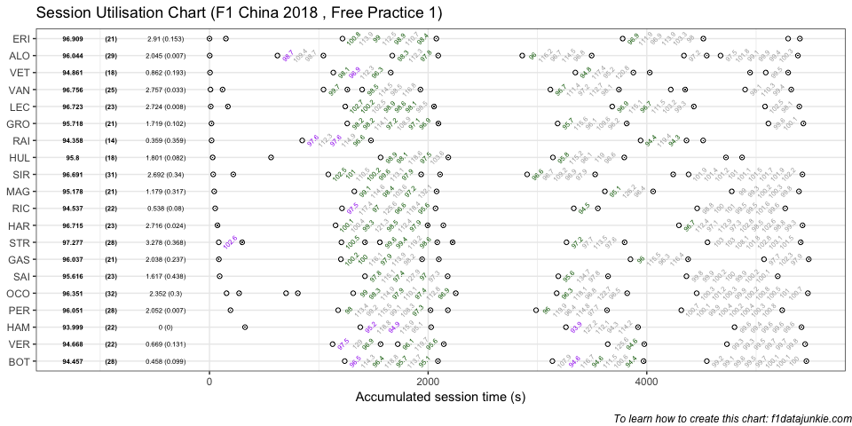
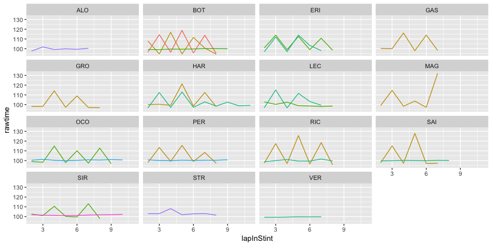

## Session Utilisation

Activity in Free Practice 1 took place as follows:

<!-- -->

### Performance Summary

| Driver            | Number | Fastest Lap |   Gap |  Diff |
| :---------------- | -----: | ----------: | ----: | ----: |
| Lewis HAMILTON    |     44 |      93.999 | 0.000 | 0.000 |
| Kimi RAIKKONEN    |      7 |      94.358 | 0.359 | 0.359 |
| Valtteri BOTTAS   |     77 |      94.457 | 0.458 | 0.099 |
| Daniel RICCIARDO  |      3 |      94.537 | 0.538 | 0.080 |
| Max VERSTAPPEN    |     33 |      94.668 | 0.669 | 0.131 |
| Sebastian VETTEL  |      5 |      94.861 | 0.862 | 0.193 |
| Kevin MAGNUSSEN   |     20 |      95.178 | 1.179 | 0.317 |
| Carlos SAINZ      |     55 |      95.616 | 1.617 | 0.438 |
| Romain GROSJEAN   |      8 |      95.718 | 1.719 | 0.102 |
| Nico HULKENBERG   |     27 |      95.800 | 1.801 | 0.082 |
| Pierre GASLY      |     10 |      96.037 | 2.038 | 0.237 |
| Fernando ALONSO   |     14 |      96.044 | 2.045 | 0.007 |
| Sergio PEREZ      |     11 |      96.051 | 2.052 | 0.007 |
| Esteban OCON      |     31 |      96.351 | 2.352 | 0.300 |
| Sergey SIROTKIN   |     35 |      96.691 | 2.692 | 0.340 |
| Brendon HARTLEY   |     28 |      96.715 | 2.716 | 0.024 |
| Charles LECLERC   |     16 |      96.723 | 2.724 | 0.008 |
| Stoffel VANDOORNE |      2 |      96.756 | 2.757 | 0.033 |
| Marcus ERICSSON   |      9 |      96.909 | 2.910 | 0.153 |
| Lance STROLL      |     18 |      97.277 | 3.278 | 0.368 |

### Stints Summary

| Driver            | Total laps | Longest run (laps) | Stints |
| :---------------- | ---------: | -----------------: | -----: |
| Esteban OCON      |         32 |                 11 |      5 |
| Sergey SIROTKIN   |         31 |                 11 |      7 |
| Fernando ALONSO   |         29 |                  8 |      6 |
| Valtteri BOTTAS   |         28 |                 10 |      3 |
| Sergio PEREZ      |         28 |                 10 |      5 |
| Lance STROLL      |         28 |                  9 |      6 |
| Stoffel VANDOORNE |         25 |                  7 |      6 |
| Brendon HARTLEY   |         23 |                 12 |      4 |
| Charles LECLERC   |         23 |                  9 |      5 |
| Carlos SAINZ      |         23 |                  9 |      4 |
| Daniel RICCIARDO  |         22 |                  9 |      4 |
| Max VERSTAPPEN    |         22 |                  8 |      4 |
| Lewis HAMILTON    |         22 |                  7 |      4 |
| Romain GROSJEAN   |         21 |                  9 |      4 |
| Marcus ERICSSON   |         21 |                  9 |      5 |
| Pierre GASLY      |         21 |                  8 |      5 |
| Kevin MAGNUSSEN   |         21 |                  8 |      4 |
| Nico HULKENBERG   |         18 |                  7 |      6 |
| Sebastian VETTEL  |         18 |                  6 |      6 |
| Kimi RAIKKONEN    |         14 |                  7 |      4 |

  - Esteban OCON completed 32 laps over 5 stints, with a longest run of
    11 laps

  - Sergey SIROTKIN completed 31 laps over 7 stints, with a longest run
    of 11 laps

  - Fernando ALONSO completed 29 laps over 6 stints, with a longest run
    of 8 laps

  - Valtteri BOTTAS completed 28 laps over 3 stints, with a longest run
    of 10 laps

  - Sergio PEREZ completed 28 laps over 5 stints, with a longest run of
    10 laps

  - Lance STROLL completed 28 laps over 6 stints, with a longest run of
    9 laps

  - Stoffel VANDOORNE completed 25 laps over 6 stints, with a longest
    run of 7 laps

  - Brendon HARTLEY completed 23 laps over 4 stints, with a longest run
    of 12 laps

  - Charles LECLERC completed 23 laps over 5 stints, with a longest run
    of 9 laps

  - Carlos SAINZ completed 23 laps over 4 stints, with a longest run of
    9 laps

  - Daniel RICCIARDO completed 22 laps over 4 stints, with a longest run
    of 9 laps

  - Max VERSTAPPEN completed 22 laps over 4 stints, with a longest run
    of 8 laps

  - Lewis HAMILTON completed 22 laps over 4 stints, with a longest run
    of 7 laps

  - Romain GROSJEAN completed 21 laps over 4 stints, with a longest run
    of 9 laps

  - Marcus ERICSSON completed 21 laps over 5 stints, with a longest run
    of 9 laps

  - Pierre GASLY completed 21 laps over 5 stints, with a longest run of
    8 laps

  - Kevin MAGNUSSEN completed 21 laps over 4 stints, with a longest run
    of 8 laps

  - Nico HULKENBERG completed 18 laps over 6 stints, with a longest run
    of 7 laps

  - Sebastian VETTEL completed 18 laps over 6 stints, with a longest run
    of 6 laps

  - Kimi RAIKKONEN completed 14 laps over 4 stints, with a longest run
    of 7 laps

### Long Runs

Laptimes on long runs of 8 or more laps
<!-- -->

-----

This website is unofficial and is not associated in any way with the
Formula 1 companies. F1, FORMULA ONE, FORMULA 1, FIA FORMULA ONE WORLD
CHAMPIONSHIP, GRAND PRIX and related marks are trade marks of Formula
One Licensing B.V.
