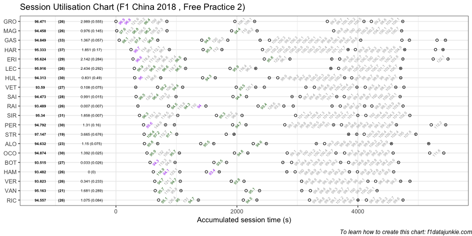
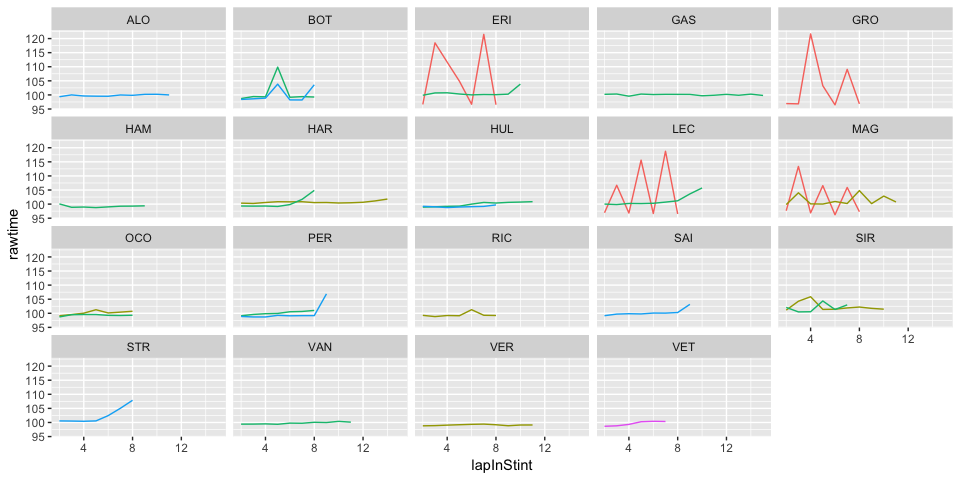

## Session Utilisation

Activity in Free Practice 2 took place as follows:

<!-- -->

### Performance Summary

| Driver            | Number | Fastest Lap | PerCent |   Gap |  Diff |
| :---------------- | -----: | ----------: | ------: | ----: | ----: |
| Lewis HAMILTON    |     44 |      93.482 |   100.0 | 0.000 | 0.000 |
| Kimi RAIKKONEN    |      7 |      93.489 |   100.0 | 0.007 | 0.007 |
| Valtteri BOTTAS   |     77 |      93.515 |   100.0 | 0.033 | 0.026 |
| Sebastian VETTEL  |      5 |      93.590 |   100.1 | 0.108 | 0.075 |
| Max VERSTAPPEN    |     33 |      93.823 |   100.4 | 0.341 | 0.233 |
| Nico HULKENBERG   |     27 |      94.313 |   100.9 | 0.831 | 0.490 |
| Kevin MAGNUSSEN   |     20 |      94.458 |   101.0 | 0.976 | 0.145 |
| Carlos SAINZ      |     55 |      94.473 |   101.1 | 0.991 | 0.015 |
| Daniel RICCIARDO  |      3 |      94.557 |   101.1 | 1.075 | 0.084 |
| Fernando ALONSO   |     14 |      94.632 |   101.2 | 1.150 | 0.075 |
| Sergio PEREZ      |     11 |      94.792 |   101.4 | 1.310 | 0.160 |
| Pierre GASLY      |     10 |      94.849 |   101.5 | 1.367 | 0.057 |
| Esteban OCON      |     31 |      94.874 |   101.5 | 1.392 | 0.025 |
| Stoffel VANDOORNE |      2 |      95.163 |   101.8 | 1.681 | 0.289 |
| Brendon HARTLEY   |     28 |      95.333 |   102.0 | 1.851 | 0.170 |
| Sergey SIROTKIN   |     35 |      95.340 |   102.0 | 1.858 | 0.007 |
| Marcus ERICSSON   |      9 |      95.624 |   102.3 | 2.142 | 0.284 |
| Charles LECLERC   |     16 |      95.916 |   102.6 | 2.434 | 0.292 |
| Romain GROSJEAN   |      8 |      96.471 |   103.2 | 2.989 | 0.555 |
| Lance STROLL      |     18 |      97.147 |   103.9 | 3.665 | 0.676 |

In Free Practice 2, Lewis HAMILTON topped the timing sheets with a
93.482s fastest lap, 0.007 ahead of Kimi RAIKKONEN in second.

### Stints Summary

| Driver            | Total laps | Longest run (laps) | Stints |
| :---------------- | ---------: | -----------------: | -----: |
| Brendon HARTLEY   |         37 |                 15 |      5 |
| Pierre GASLY      |         33 |                 16 |      6 |
| Sergey SIROTKIN   |         31 |                 11 |      4 |
| Nico HULKENBERG   |         30 |                 12 |      5 |
| Sergio PEREZ      |         30 |                 10 |      6 |
| Esteban OCON      |         30 |                  9 |      5 |
| Marcus ERICSSON   |         29 |                 11 |      5 |
| Carlos SAINZ      |         28 |                 10 |      5 |
| Valtteri BOTTAS   |         27 |                  9 |      5 |
| Sebastian VETTEL  |         27 |                  8 |      8 |
| Max VERSTAPPEN    |         26 |                 12 |      5 |
| Kevin MAGNUSSEN   |         26 |                 12 |      3 |
| Charles LECLERC   |         26 |                 11 |      4 |
| Lewis HAMILTON    |         26 |                 10 |      5 |
| Romain GROSJEAN   |         26 |                  9 |      4 |
| Daniel RICCIARDO  |         26 |                  9 |      4 |
| Kimi RAIKKONEN    |         26 |                  7 |      7 |
| Fernando ALONSO   |         23 |                 12 |      6 |
| Stoffel VANDOORNE |         21 |                 12 |      4 |
| Lance STROLL      |         19 |                  9 |      5 |

  - Brendon HARTLEY completed 37 laps over 5 stints, with a longest run
    of 15 laps and a fastest lap of 95.333s overall (15th, 102% of
    session best).

  - Pierre GASLY completed 33 laps over 6 stints, with a longest run of
    16 laps and a fastest lap of 94.849s overall (12th, 101.5% of
    session best).

  - Sergey SIROTKIN completed 31 laps over 4 stints, with a longest run
    of 11 laps and a fastest lap of 95.34s overall (16th, 102% of
    session best).

  - Nico HULKENBERG completed 30 laps over 5 stints, with a longest run
    of 12 laps and a fastest lap of 94.313s overall (6th, 100.9% of
    session best).

  - Sergio PEREZ completed 30 laps over 6 stints, with a longest run of
    10 laps and a fastest lap of 94.792s overall (11th, 101.4% of
    session best).

  - Esteban OCON completed 30 laps over 5 stints, with a longest run of
    9 laps and a fastest lap of 94.874s overall (13th, 101.5% of session
    best).

  - Marcus ERICSSON completed 29 laps over 5 stints, with a longest run
    of 11 laps and a fastest lap of 95.624s overall (17th, 102.3% of
    session best).

  - Carlos SAINZ completed 28 laps over 5 stints, with a longest run of
    10 laps and a fastest lap of 94.473s overall (8th, 101.1% of session
    best).

  - Valtteri BOTTAS completed 27 laps over 5 stints, with a longest run
    of 9 laps and a fastest lap of 93.515s overall (3rd, just 0.033s
    behind the fastest time in the session).

  - Sebastian VETTEL completed 27 laps over 8 stints, with a longest run
    of 8 laps and a fastest lap of 93.59s overall (4th, 100.1% of
    session best).

  - Max VERSTAPPEN completed 26 laps over 5 stints, with a longest run
    of 12 laps and a fastest lap of 93.823s overall (5th, 100.4% of
    session best).

  - Kevin MAGNUSSEN completed 26 laps over 3 stints, with a longest run
    of 12 laps and a fastest lap of 94.458s overall (7th, 101% of
    session best).

  - Charles LECLERC completed 26 laps over 4 stints, with a longest run
    of 11 laps and a fastest lap of 95.916s overall (18th, 102.6% of
    session best).

  - Lewis HAMILTON completed 26 laps over 5 stints, with a longest run
    of 10 laps and a fastest lap of 93.482s overall (1st, fastest in the
    session).

  - Romain GROSJEAN completed 26 laps over 4 stints, with a longest run
    of 9 laps and a fastest lap of 96.471s overall (19th, 103.2% of
    session best).

  - Daniel RICCIARDO completed 26 laps over 4 stints, with a longest run
    of 9 laps and a fastest lap of 94.557s overall (9th, 101.1% of
    session best).

  - Kimi RAIKKONEN completed 26 laps over 7 stints, with a longest run
    of 7 laps and a fastest lap of 93.489s overall (2nd, just 0.007s
    behind the fastest time in the session).

  - Fernando ALONSO completed 23 laps over 6 stints, with a longest run
    of 12 laps and a fastest lap of 94.632s overall (10th, 101.2% of
    session best).

  - Stoffel VANDOORNE completed 21 laps over 4 stints, with a longest
    run of 12 laps and a fastest lap of 95.163s overall (14th, 101.8% of
    session best).

  - Lance STROLL completed 19 laps over 5 stints, with a longest run of
    9 laps and a fastest lap of 97.147s overall (20th, 103.9% of session
    best).

### Long Runs

Laptimes on long runs of 8 or more laps
<!-- -->

-----

This website is unofficial and is not associated in any way with the
Formula 1 companies. F1, FORMULA ONE, FORMULA 1, FIA FORMULA ONE WORLD
CHAMPIONSHIP, GRAND PRIX and related marks are trade marks of Formula
One Licensing B.V.
