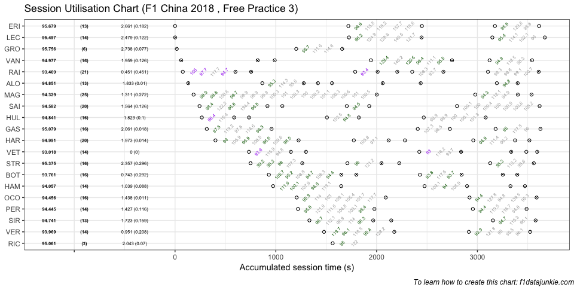
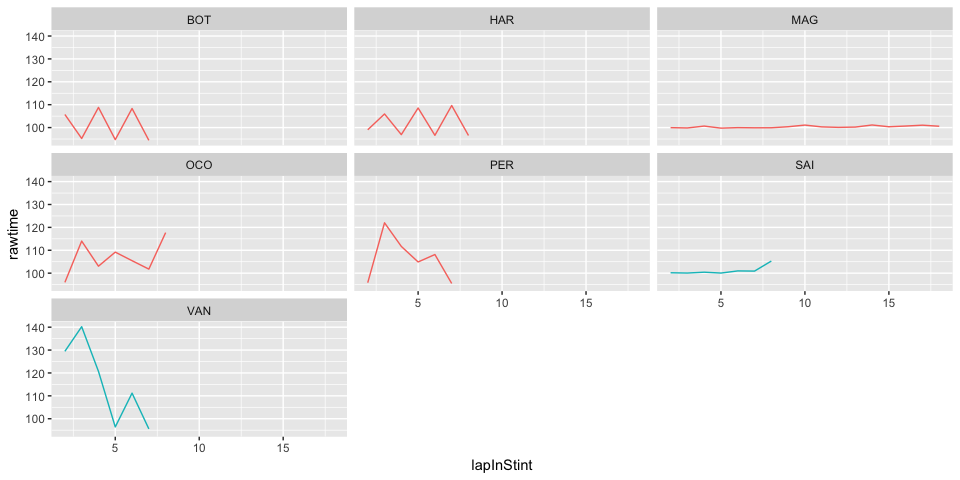

## Session Utilisation

Activity in Free Practice 3 took place as follows:

<!-- -->

### Performance Summary

| Driver            | Number | Fastest Lap | PerCent |   Gap |  Diff |
| :---------------- | -----: | ----------: | ------: | ----: | ----: |
| Sebastian VETTEL  |      5 |      93.018 |   100.0 | 0.000 | 0.000 |
| Kimi RAIKKONEN    |      7 |      93.469 |   100.5 | 0.451 | 0.451 |
| Valtteri BOTTAS   |     77 |      93.761 |   100.8 | 0.743 | 0.292 |
| Max VERSTAPPEN    |     33 |      93.969 |   101.0 | 0.951 | 0.208 |
| Lewis HAMILTON    |     44 |      94.057 |   101.1 | 1.039 | 0.088 |
| Kevin MAGNUSSEN   |     20 |      94.329 |   101.4 | 1.311 | 0.272 |
| Sergio PEREZ      |     11 |      94.445 |   101.5 | 1.427 | 0.116 |
| Esteban OCON      |     31 |      94.456 |   101.5 | 1.438 | 0.011 |
| Carlos SAINZ      |     55 |      94.582 |   101.7 | 1.564 | 0.126 |
| Sergey SIROTKIN   |     35 |      94.741 |   101.9 | 1.723 | 0.159 |
| Nico HULKENBERG   |     27 |      94.841 |   102.0 | 1.823 | 0.100 |
| Fernando ALONSO   |     14 |      94.851 |   102.0 | 1.833 | 0.010 |
| Stoffel VANDOORNE |      2 |      94.977 |   102.1 | 1.959 | 0.126 |
| Brendon HARTLEY   |     28 |      94.991 |   102.1 | 1.973 | 0.014 |
| Daniel RICCIARDO  |      3 |      95.061 |   102.2 | 2.043 | 0.070 |
| Pierre GASLY      |     10 |      95.079 |   102.2 | 2.061 | 0.018 |
| Lance STROLL      |     18 |      95.375 |   102.5 | 2.357 | 0.296 |
| Charles LECLERC   |     16 |      95.497 |   102.7 | 2.479 | 0.122 |
| Marcus ERICSSON   |      9 |      95.679 |   102.9 | 2.661 | 0.182 |
| Romain GROSJEAN   |      8 |      95.756 |   102.9 | 2.738 | 0.077 |

In Free Practice 3, Sebastian VETTEL topped the timing sheets with a
93.018s fastest lap, 0.451 ahead of Kimi RAIKKONEN in second.

### Stints Summary

| Driver            | Total laps | Longest run (laps) | Stints |
| :---------------- | ---------: | -----------------: | -----: |
| Kevin MAGNUSSEN   |         25 |                 19 |      3 |
| Kimi RAIKKONEN    |         21 |                  6 |      6 |
| Carlos SAINZ      |         20 |                  9 |      4 |
| Brendon HARTLEY   |         20 |                  9 |      5 |
| Esteban OCON      |         16 |                  9 |      2 |
| Valtteri BOTTAS   |         16 |                  8 |      5 |
| Stoffel VANDOORNE |         16 |                  8 |      5 |
| Pierre GASLY      |         16 |                  7 |      3 |
| Nico HULKENBERG   |         16 |                  7 |      4 |
| Lance STROLL      |         16 |                  6 |      4 |
| Sergio PEREZ      |         14 |                  8 |      2 |
| Max VERSTAPPEN    |         14 |                  7 |      2 |
| Lewis HAMILTON    |         14 |                  7 |      4 |
| Charles LECLERC   |         14 |                  7 |      3 |
| Sebastian VETTEL  |         14 |                  5 |      5 |
| Sergey SIROTKIN   |         13 |                  7 |      3 |
| Marcus ERICSSON   |         13 |                  7 |      3 |
| Fernando ALONSO   |         13 |                  5 |      7 |
| Romain GROSJEAN   |          6 |                  5 |      2 |
| Daniel RICCIARDO  |          3 |                  3 |      1 |

  - Kevin MAGNUSSEN completed 25 laps over 3 stints, with a longest run
    of 19 laps and a fastest lap of 94.329s overall (6th, 101.4% of
    session best).

  - Kimi RAIKKONEN completed 21 laps over 6 stints, with a longest run
    of 6 laps and a fastest lap of 93.469s overall (2nd, 100.5% of
    session best).

  - Carlos SAINZ completed 20 laps over 4 stints, with a longest run of
    9 laps and a fastest lap of 94.582s overall (9th, 101.7% of session
    best).

  - Brendon HARTLEY completed 20 laps over 5 stints, with a longest run
    of 9 laps and a fastest lap of 94.991s overall (14th, 102.1% of
    session best).

  - Esteban OCON completed 16 laps over 2 stints, with a longest run of
    9 laps and a fastest lap of 94.456s overall (8th, 101.5% of session
    best).

  - Valtteri BOTTAS completed 16 laps over 5 stints, with a longest run
    of 8 laps and a fastest lap of 93.761s overall (3rd, 100.8% of
    session best).

  - Stoffel VANDOORNE completed 16 laps over 5 stints, with a longest
    run of 8 laps and a fastest lap of 94.977s overall (13th, 102.1% of
    session best).

  - Pierre GASLY completed 16 laps over 3 stints, with a longest run of
    7 laps and a fastest lap of 95.079s overall (16th, 102.2% of session
    best).

  - Nico HULKENBERG completed 16 laps over 4 stints, with a longest run
    of 7 laps and a fastest lap of 94.841s overall (11th, 102% of
    session best).

  - Lance STROLL completed 16 laps over 4 stints, with a longest run of
    6 laps and a fastest lap of 95.375s overall (17th, 102.5% of session
    best).

  - Sergio PEREZ completed 14 laps over 2 stints, with a longest run of
    8 laps and a fastest lap of 94.445s overall (7th, 101.5% of session
    best).

  - Max VERSTAPPEN completed 14 laps over 2 stints, with a longest run
    of 7 laps and a fastest lap of 93.969s overall (4th, 101% of session
    best).

  - Lewis HAMILTON completed 14 laps over 4 stints, with a longest run
    of 7 laps and a fastest lap of 94.057s overall (5th, 101.1% of
    session best).

  - Charles LECLERC completed 14 laps over 3 stints, with a longest run
    of 7 laps and a fastest lap of 95.497s overall (18th, 102.7% of
    session best).

  - Sebastian VETTEL completed 14 laps over 5 stints, with a longest run
    of 5 laps and a fastest lap of 93.018s overall (1st, fastest in the
    session).

  - Sergey SIROTKIN completed 13 laps over 3 stints, with a longest run
    of 7 laps and a fastest lap of 94.741s overall (10th, 101.9% of
    session best).

  - Marcus ERICSSON completed 13 laps over 3 stints, with a longest run
    of 7 laps and a fastest lap of 95.679s overall (19th, 102.9% of
    session best).

  - Fernando ALONSO completed 13 laps over 7 stints, with a longest run
    of 5 laps and a fastest lap of 94.851s overall (12th, 102% of
    session best).

  - Romain GROSJEAN completed 6 laps over 2 stints, with a longest run
    of 5 laps and a fastest lap of 95.756s overall (20th, 102.9% of
    session best).

  - Daniel RICCIARDO completed 3 laps over 1 stints, with a longest run
    of 3 laps and a fastest lap of 95.061s overall (15th, 102.2% of
    session best).

### Long Runs

Laptimes on long runs of 8 or more laps
<!-- -->

-----

This website is unofficial and is not associated in any way with the
Formula 1 companies. F1, FORMULA ONE, FORMULA 1, FIA FORMULA ONE WORLD
CHAMPIONSHIP, GRAND PRIX and related marks are trade marks of Formula
One Licensing B.V.
