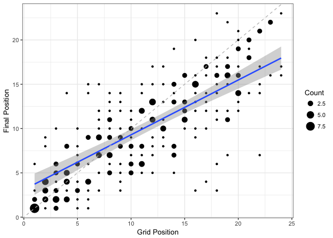
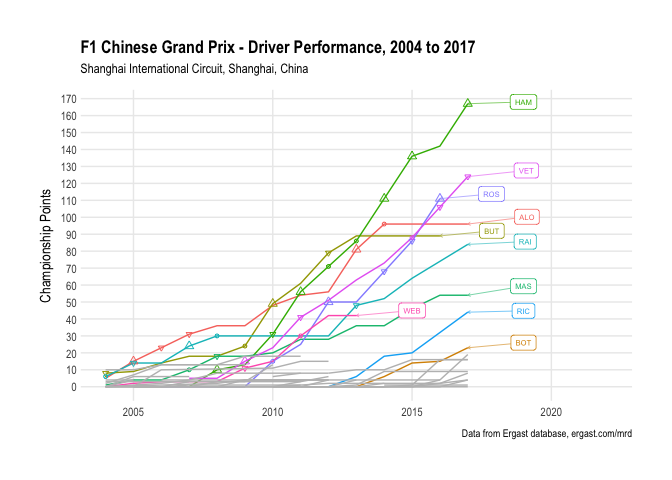
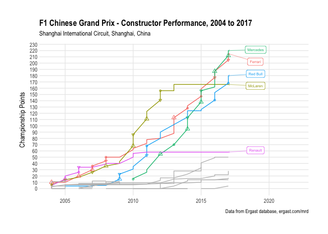

### Drivers’ & Constructors’ Circuit Performance

How well do drivers and constructors perform at the circuit?

The *Driver Performance Chart* and *Constructor Performance Chart* show
how drivers and constructors fare based on points scored at the circuit.
(Note that points schemes may change over the reporting period.)

<!-- -->

Historical likelihood of winning from pole: 64.29, NA%

<!-- -->

Poles at this circuit:

| Driver | Poles |
| :----- | ----: |
| HAM    |     6 |
| VET    |     3 |
| ALO    |     2 |
| ROS    |     2 |
| BAR    |     1 |

Individual winners at this circuit:

| Driver | Wins |
| :----- | ---: |
| HAM    |    5 |
| ALO    |    2 |
| RAI    |    1 |
| VET    |    1 |

Podiums at this circuit:

| Driver | Podiums |
| :----- | ------: |
| HAM    |       8 |
| RAI    |       5 |
| ALO    |       5 |
| VET    |       5 |
| VER    |       1 |

<!-- -->
