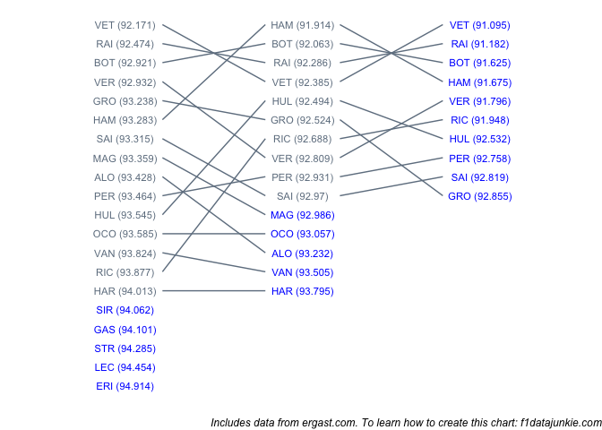
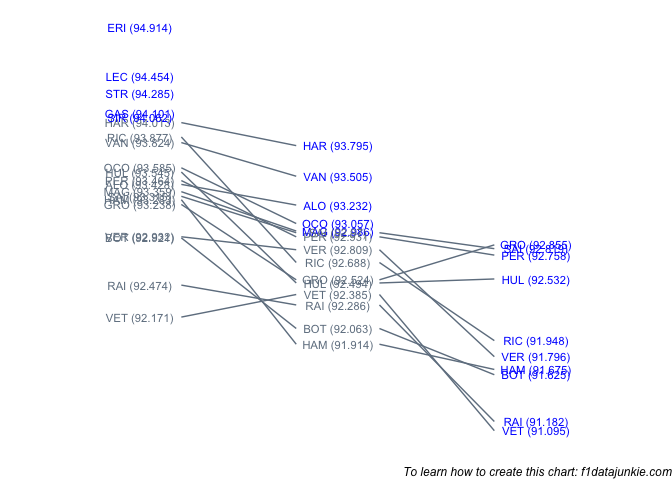

Drivers progressed through the qualifying session as follows:

<!-- -->

<!-- -->

## Q1 into Q2

The following teams did not make it through:

| TEAM       | freq |
| :--------- | ---: |
| Sauber     |    2 |
| Toro Rosso |    1 |
| Williams   |    1 |

  - neither Sauber made it through from Q1 to Q2

  - VET failed to improve his time from Q1, recording 92.385 compared to
    92.171 (0.214s slower)

## Q2 into Q3

The following teams did not make it through:

| TEAM         | freq |
| :----------- | ---: |
| Force India  |    1 |
| Haas F1 Team |    1 |
| McLaren      |    2 |
| Toro Rosso   |    1 |
| Williams     |    1 |

  - neither McLaren made it through from Q2 to Q3

  - both Ferrari cars made it through to Q3

  - both Mercedes cars made it through to Q3

  - both Red Bull cars made it through to Q3

  - both Renault cars made it through to Q3

  - HUL failed to improve his time from Q2, recording 92.532 compared to
    92.494 (0.038s slower)

  - GRO failed to improve his time from Q2, recording 92.855 compared to
    92.524 (0.331s slower)
