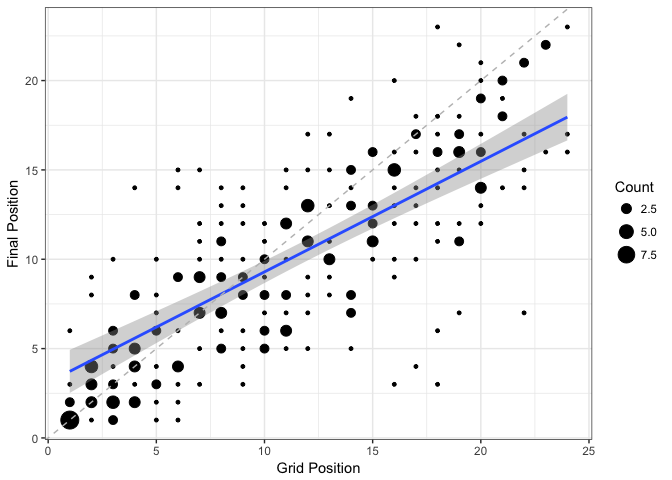
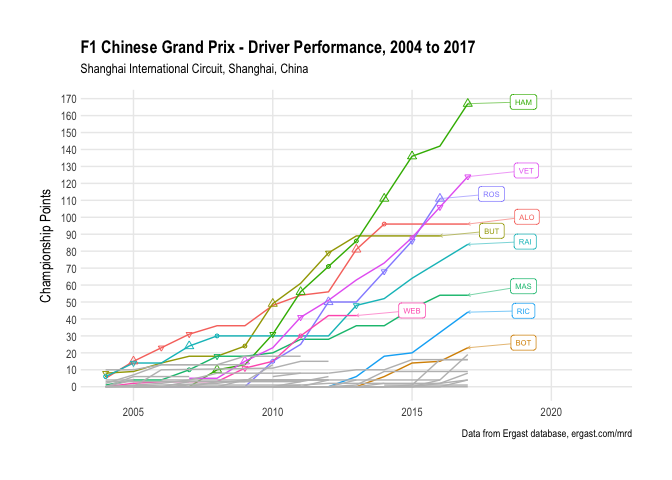
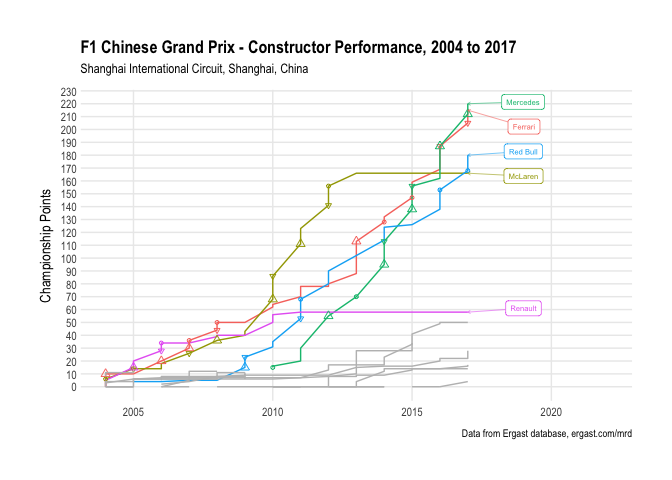
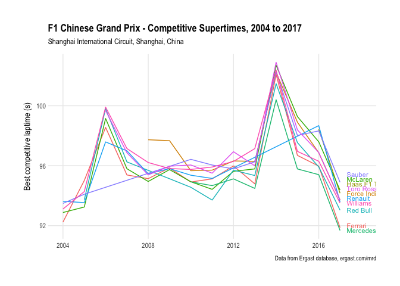
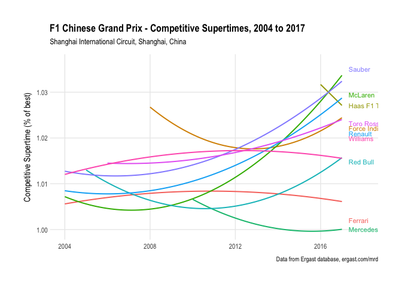
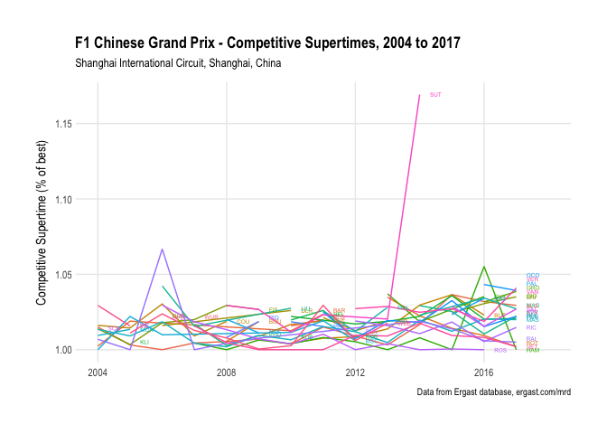
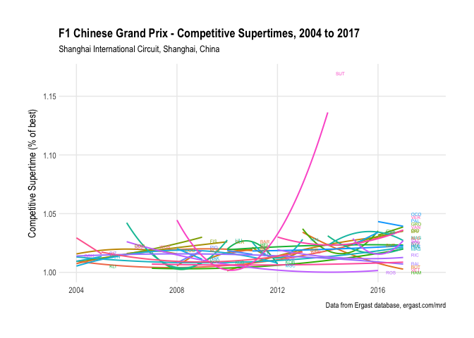

## The Story So Far

Coming into the 3rd race of 2018, the championship points race is as
follows:

### Drivers’ Championship - Standings

| Position | Driver | Points |
| -------: | :----- | -----: |
|        1 | VET    |     50 |
|        2 | HAM    |     33 |
|        3 | BOT    |     22 |
|        4 | ALO    |     16 |
|        5 | RAI    |     15 |
|        6 | HUL    |     14 |
|        7 | GAS    |     12 |
|        8 | RIC    |     12 |
|        9 | MAG    |     10 |
|       10 | VER    |      8 |
|       11 | VAN    |      6 |
|       12 | ERI    |      2 |
|       13 | SAI    |      1 |
|       14 | OCO    |      1 |
|       15 | PER    |      0 |
|       16 | LEC    |      0 |
|       17 | HAR    |      0 |
|       18 | STR    |      0 |
|       19 | GRO    |      0 |
|       20 | SIR    |      0 |

### Constructors’ Championship - Standings

| Position | Constructor  | Points |
| -------: | :----------- | -----: |
|        1 | Ferrari      |     65 |
|        2 | Mercedes     |     55 |
|        3 | McLaren      |     22 |
|        4 | Red Bull     |     20 |
|        5 | Renault      |     15 |
|        6 | Toro Rosso   |     12 |
|        7 | Haas F1 Team |     10 |
|        8 | Sauber       |      2 |
|        9 | Force India  |      1 |
|       10 | Williams     |      0 |

### Races to Date

### Upcoming Race Trivia…

Coming in to the race:

  - BOT is looking for their 5th ever pole position

  - HAM is looking for their 120th ever front row start

  - HAM is looking for their 120th ever podium finish

  - VET is looking for their 50th ever race win 

  - HAM is looking for their 40th ever win from pole

### Circuit Performance

How well do drivers and constructors perform at the circuit?

The *Driver Performance Chart* and *Constructor Performance Chart* show
how drivers and constructors fare based on points scored at the circuit.
(Note that points schemes may change over the reporting
period.)

### Final Position From Grid Position

<!-- -->

Historical likelihood of winning from pole: 64.29%

<!-- -->

Poles at this circuit:

| Driver | Poles |
| :----- | ----: |
| HAM    |     6 |
| VET    |     3 |
| ALO    |     2 |
| ROS    |     2 |
| BAR    |     1 |

Individual winners at this circuit:

| Driver | Wins |
| :----- | ---: |
| HAM    |    5 |
| ALO    |    2 |
| RAI    |    1 |
| VET    |    1 |

Podiums at this circuit:

| Driver | Podiums |
| :----- | ------: |
| HAM    |       8 |
| RAI    |       5 |
| ALO    |       5 |
| VET    |       5 |
| VER    |       1 |

<!-- -->

### Circuit Competitive Laptimes

### Circuit Competitive Supertimes

*Supertimes* are often provided as a season wide performance metric for
comparing performances over a season. At the manufacturer level, they
are typically calculated for each manufacturer as the average of their
fastest single lap recorded by the team at each race weekend expressed
as a percentage of the fastest single lap overall.

We can also derive a reduced *competitive supertime* by basing the
calculation on best laptime recorded across the qualifying and race
sessions, omitting laptimes recorded in the practice sessions.

We can draw on the notion of supertimes to derive two simple measures
for comparing team performances based on laptime:

  - evolution of manufacturer competitive supertime for a circuit over
    the years;
  - evolution of manufacturer competitive supertime for each circuit
    over the course of a season.

We can also produce driver performance metrics based on the competitive
supertime of each driver.

## Competitive Supertime Evolution

<!-- -->

<!-- -->

<!-- -->

<!-- -->

| code |  avstime | races |
| :--- | -------: | ----: |
| VET  | 1.006943 |    11 |
| HAM  | 1.008284 |    11 |
| ALO  | 1.012918 |    14 |
| RAI  | 1.012931 |    10 |
| RIC  | 1.014045 |     6 |
| BOT  | 1.016576 |     5 |
| PER  | 1.020004 |     7 |
| HUL  | 1.022420 |     7 |
| SAI  | 1.023747 |     3 |
| STR  | 1.025175 |     1 |
| VER  | 1.027962 |     6 |
| MAG  | 1.028100 |     3 |
| ERI  | 1.030046 |     3 |
| GRO  | 1.035178 |     2 |
| VAN  | 1.036486 |     1 |
| OCO  | 1.041646 |     1 |
